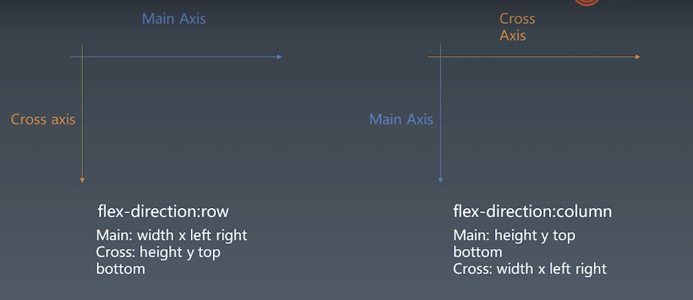

# 浏览器工作原理

## 1. 根据浏览器属性进行排版
采用flex布局排版

三代排版技术：
1. 正常流：position, display, float
2. flex
3. grid

主要工作:
1. 预处理工作
2. 具体的`width, height, left, right, top, bottom`属性抽象成 main, cross 相关属性

## 2. 收集元素进行
分行：
- 根据主轴尺寸，把元素分进行
- 若设置了no-wrap, 则强行分进第一行

## 3. 计算主轴
- 找出所有Flex元素
- 把主轴方向剩余尺寸按比例分配给这些元素
- no-wrap时，若剩余空间为负数，所有flex元素为0，等比压缩剩余元素

## 4. 计算交叉轴
- 根据每一行最大元素尺寸计算行高
- 根据行高flex-align和item-align，确定元素具体位置

## 5. 绘制单个元素
- 绘制需要依赖图形环境
- 这里采用npm包images
- 绘制在一个viewport上进行
- 与绘制相关的属性：background-color, border, background-image等

## 6. 绘制DOM树
- 递归调用子元素的绘制方法完成DOM树的绘制
- 忽略一些不需要绘制的节点
- 实际浏览器中，文字绘制是难点，需要依赖字体库，这里忽略
- 实际浏览器中，还会多一些图层做compositing, 这里也忽略了

## 总结
这周实现了DOM树布局绘制的过程。主要是实现flex布局。学习过程中，更了解了flex布局。

在最后绘制过程中遇到一个问题是，没有看到#container元素的白色背景，通过`render`函数中调试，发现是高度属性为NaN导致。考虑可能是交叉轴的实现中产生了问题，再去`layout`函数中调试，最终发现是笔误把`style[crossSize]`打成了`style[crossSpace]`导致的。